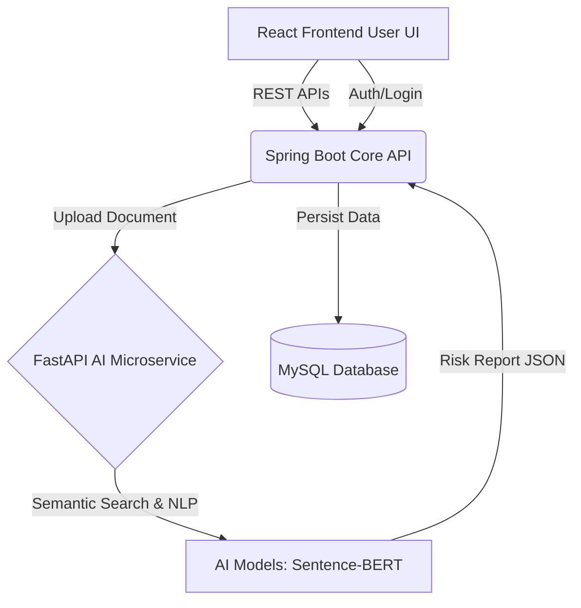

# Final Project Report: Smart Legal Assistance and Lawyer Recommendation System

## 1. Abstract
The "Smart Legal Assistance and Lawyer Recommendation System" is an AI-powered enterprise platform designed to democratize access to legal insights. It allows users to upload legal contracts for automated risk assessment using Natural Language Processing (NLP) and recommends highly suitable lawyers based on the extracted case parameters.

## 2. Introduction & Problem Statement
Understanding complex legal jargon is a massive hurdle for the general public. Traditional consultations are expensive. This system aims to solve this by providing a preliminary AI-driven analysis of legal documents, highlighting risky clauses (e.g., hidden liabilities, extreme termination conditions), and seamlessly connecting the user to verified legal professionals.

## 3. Technology Stack & Architecture
The system employs a microservices architecture:
- **Frontend Layer**: Built with React (Vite) and styled with TailwindCSS for a responsive, modern, "glassmorphism" aesthetic. State is managed via Redux.
- **Core Backend Service**: A Java Spring Boot application handling authentication (JWT), role-based access control, file storage, and relational data management using MySQL.
- **AI Microservice**: A Python FastAPI application running isolated NLP tasks. It uses `sentence-transformers` (all-MiniLM-L6-v2) to generate semantic embeddings for queries and documents, classifying them with high accuracy.

## 4. System Design (Microservices)

## 5. Modules Implemented
- **Authentication Module**: Secure JWT-based registration and login for Users and Lawyers.
- **AI Analysis Module**: Microservice endpoint that accepts multipart files, processes the text, and returns structured risk data.
- **Lawyer Recommendation Module**: An intelligent matching algorithm considering case category, geographic location, and lawyer success rates.
- **User Dashboard**: A beautiful interface for clients to view uploaded documents and AI-generated risk reports.

## 6. Conclusion and Future Scope
This project successfully demonstrates the integration of modern AI techniques into a traditional web application stack. Future enhancements include implementing full Legal-BERT for deep contextual analysis, integrating a WebSocket chat module for real-time lawyer-client communication, and adding Razorpay for seamless consultation fee payments.
